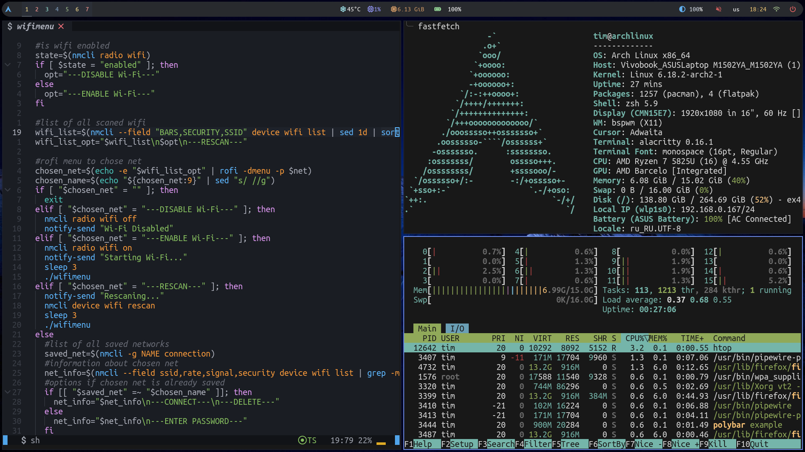
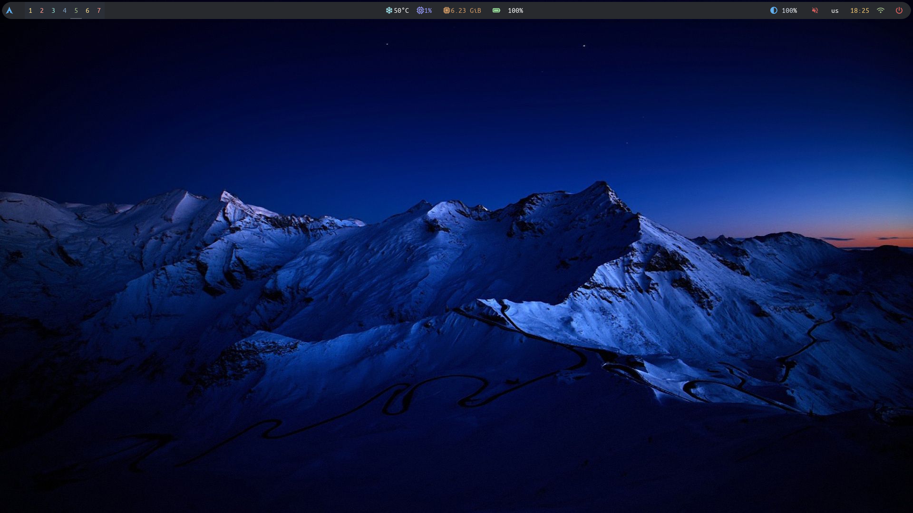

# 🌌 bspwm-dotfiles by Ferrddd

> Minimal. Fast. Aesthetic. Configured for **workflow, not for show**.

---

## 🧰 About

- **WM**: [bspwm](https://github.com/baskerville/bspwm)
- **Hotkeys**: [sxhkd](https://github.com/baskerville/sxhkd)
- **Panel**: [polybar](https://github.com/polybar/polybar)
- **Terminal**: [alacritty](https://github.com/alacritty/alacritty)
- **Shell**: zsh + [oh-my-zsh](https://ohmyz.sh/)
- **Notifications**: [dunst](https://dunst-project.org/)
- **Launcher**: [rofi](https://github.com/davatorium/rofi)
- **Compositor**: [picom](https://github.com/yshui/picom)
- **File manager**: [ranger](https://github.com/ranger/ranger)
- **OS**: Arch Linux (но конфиги легко адаптируются под любой дистрибутив)

---

## 🖼️ Gallery

---

## 🔥 Shortcuts
### 🧰 Applications
- *Super + Return*: aclaritty
- *Super + f*: Firefox
- *Super + t*: Telegram
- *Super + c*: code
- *Super + l*: LibreOffice

### 🖥️ Windows
- *Super + w*: close window
- *Super + Tab*: focus next window on current desktop
- *Super + d*: run menu
- *Super + p*: power menu

### 💡 Other 
- *Super + Print*: capture full-screen screenshot
- *Print*: select area for screenshot

For full list check `.config/sxhkd/sxhkdrc`

